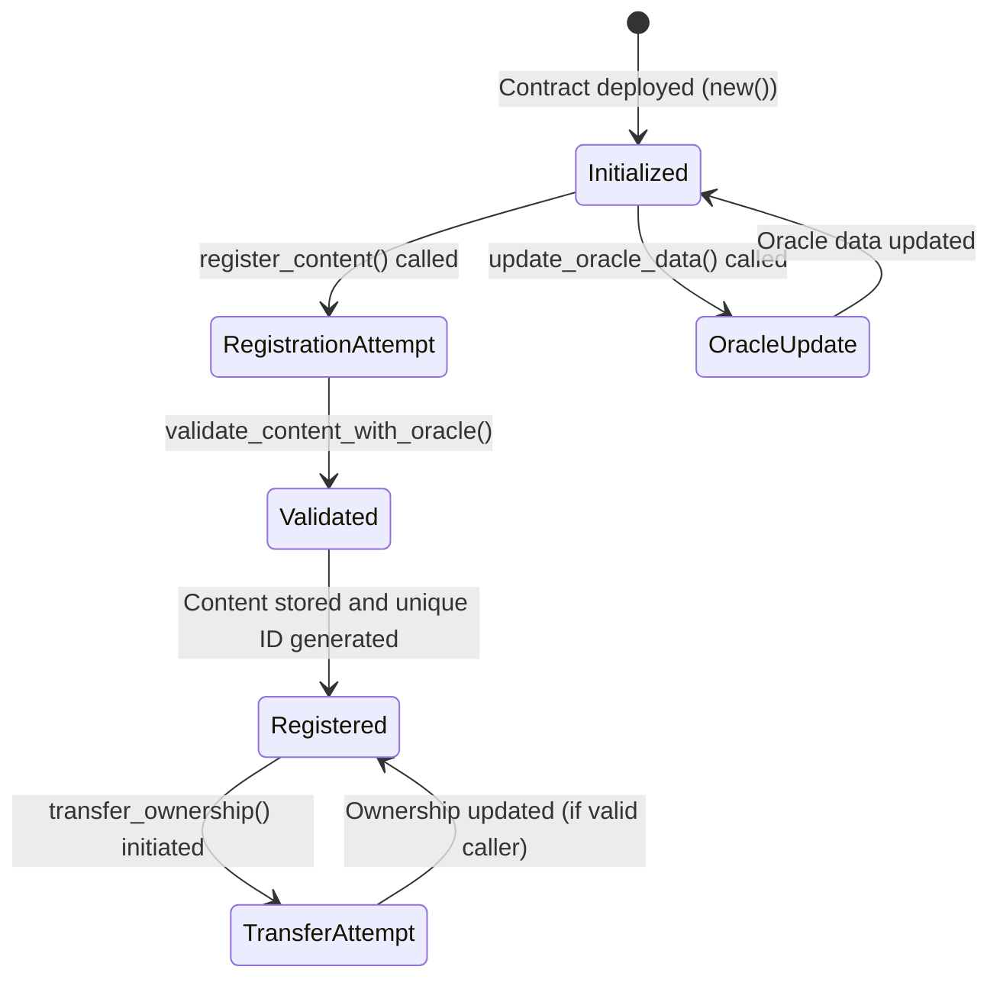
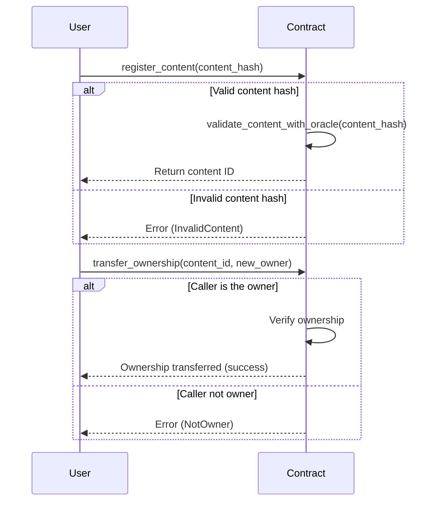

# A simple Content Ownership smart contract

This contract allows you to create a content registry, and users can create content to be stored in the registry.

It facilitates the on-chain record of content (i.e., files on IPFS) ownership and transfer. While one cannot prevent others from obtaining a copy of the content, the app owner of the contract can serve as the single source of truth of who owns the content. With the blockchain trace and record in place, it provides a trustless way to verify the ownership of the content and facilitates further application logic such as royalties, licensing, etc.

## Key Features

| Feature                          | Description                                                                 |
|----------------------------------|-----------------------------------------------------------------------------|
| **Admin Control**                | The deployer of the contract is the admin and can update oracle data        |
| **Content Registration**         | Users can register digital content with a unique identifier (e.g. IPFS hash)|
| **Ownership Transfer**           | Ownership of registered content can be transferred securely                 |
| **Oracle Validation**            | Content hashes are validated against oracle data for integrity              |
| **Content Retrieval**            | Retrieve content details by its unique identifier                           |

## Data Structures

| Component            | Type                          | Description                                                             |
|-----------------------|-------------------------------|------------------------------------------------------------------------|
| **Content**           | `struct`                     | Represents a digital content record                                     |
| **Error**             | `enum`                       | Custom error types for contract operations                              |
| **ContentOwnership**  | `struct`                     | The main storage structure of the contract                              |

## Functions Overview

### `new()` - Initializes the Contract

- **Key Points:**
- Sets the deployer as admin  
- Uses default values

### `update_oracle_data(new_data: String)` - Updates Oracle Data

- **Key Points:**
- Only the **admin** can update  
- Stores the new oracle reference

### `register_content(content_hash: String)` - Registers New Content

- **Key Points:**  
- Validates the content hash against the oracle data  
- Checks for duplicate content  
- Generates a unique ID and stores the content record

### `transfer_ownership(content_id: u64, new_owner: AccountId)` - Transfers Ownership

- **Key Points:**  
- Verifies the caller is the current owner  
- Updates the record with the new owner

### `get_content(content_id: u64)` - Retrieves Content Record

- **Key Points:**
- Returns the content record if found

### `get_oracle_data()` - Retrieves Current Oracle Data

- **Key Points:**  
- Returns the stored oracle data

## State Diagram

## Sequence Diagram

